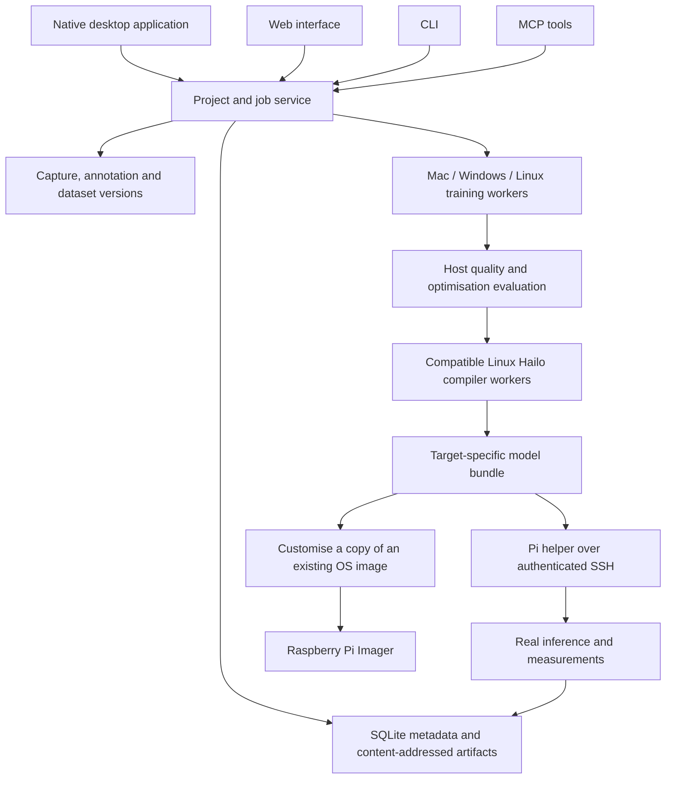

# Raspberry Pi AI Trainer — architecture and delivery plan

Status: implemented local workbench with executable training, compilation, packaging, image-customisation and device providers; SDK and hardware qualification remain separate acceptance gates. Research checked 10 September 2026 (Australia/Sydney). Owner has Hailo-8L and Hailo-8; Hailo-10H software is in scope now, physical validation deferred. No training runs on a Raspberry Pi.

## Product decision

Build one local-first workbench with a shared domain service, four interfaces, replaceable training/compilation workers and a small Pi agent. Separate the cross-platform application from the platform-specific compute tools. A Mac user must be able to prepare data, train a supported model locally and submit compilation to a Linux machine without handling intermediate files manually.

The application uses a Python standard-library core, SQLite, a web frontend, a native Tk desktop client, CLI and stdio MCP. A dedicated native workflow dialog exposes job specifications, progress, logs, cancellation, device/worker enrollment and dependency discovery. Compute frameworks and vendor SDKs live in selected worker environments rather than the core application. Source execution and locally built Mac app/CLI bundles are available. The bundles contain the controller; provider Python environments remain external. Signing and Windows/Linux package execution require their own release validation. CLI and MCP do not depend on a desktop window remaining open.

Reuse was checked against the existing the LLM-Optimise source README: it documents Python/web/Tauri, experiment evaluation, training adapters and MCP. The application reuses its MIT-licensed training-recipe, quality-scoring and memory-estimation utilities with recorded provenance. Durable process supervision and bounded host optimisation now exist in this project; additional packaging and richer evaluation patterns remain candidates; see [the reuse inventory](llm-optimise-reuse.md). Keep this project separate; do not treat its GGUF/llama.cpp inference path as a Hailo compiler. No existing project was modified. Integrate established dataset annotation, training and vendor compilation tools instead of implementing replacements.

## Hardware and toolchain boundaries

| Target | Initial workload | Build environment | Pi runtime profile | Validation |
|---|---|---|---|---|
| Hailo-8L | Classification, detection, segmentation, pose where supported | Model Zoo 2.19.0 + DFC 3.34.0 tested | `hailo-all`; physical test used HailoRT 4.23.0 | Physical synthetic inference passed; settings preserved |
| Hailo-8 | Same supported vision families; own target build | Model Zoo 2.19.0 + DFC 3.34.0 tested | `hailo-all`, matched driver/runtime | SDK fixture passed; hardware untested |
| Hailo-10H vision | Supported 10H vision architectures | Separate pinned 10H compiler/toolchain | `hailo-h10-all` | Software development now, hardware test deferred |
| Hailo-10H LLM/VLM | Supported model families and shapes only | Off-Pi training plus vendor GenAI export/quantisation/compilation recipe | HailoRT GenAI / hailo-ollama as appropriate | SDK and model-specific qualification required; hardware deferred |

Hailo's current Model Zoo README explicitly separates 8/8L from master (10/15). A retrieved v2.16 guide specifies DFC 3.30.0, HailoRT 4.20.0, Ubuntu 20.04/22.04 and Python 3.8–3.10. These are a documented reference combination, not a claim that they match the user's installed Pi. The master README reports 5.4 while its getting-started page reports 5.3: do not resolve that discrepancy by guessing. Discover and pin a tested SDK/Model Zoo/runtime tuple before compilation. [Hailo compatibility](https://github.com/hailo-ai/hailo_model_zoo), [v2.16 guide](https://github.com/hailo-ai/hailo_model_zoo/blob/v2.16/docs/GETTING_STARTED.rst).

The compiler is designed for Ubuntu x86; vendor documentation describes WSL2. Do not promise native macOS or ARM Linux compiler execution. Apple Silicon uses a remote x86-64 worker; Windows uses an appropriately configured WSL2 or remote worker; Linux x86-64 uses an isolated local or remote environment. Training may use Apple Metal/MLX, CUDA or CPU where its selected framework and recipe support them. GPU acceleration inside a container is platform-dependent. Application Python and vendor worker Python are deliberately independent. [Hailo DFC host guidance](https://community.hailo.ai/t/how-to-install-the-hailo-dataflow-compiler-dfc-on-wsl2/2890).

Raspberry Pi lists 8/8L for vision and 10H for vision plus GenAI. A target's TOPS and nominal RAM are not model compatibility tests. The Pi packages `hailo-all` and `hailo-h10-all` cannot coexist; image profiles must be separate. Match HEF target, driver, runtime, preprocessing and postprocessing as a deployment unit. [AI HAT hardware](https://www.raspberrypi.com/documentation/accessories/ai-hat-plus.html), [Pi software and package compatibility](https://www.raspberrypi.com/documentation/computers/ai.html).

## Components and ownership

The service owns projects, manifests, datasets, recipe versions, worker capabilities, jobs, artifacts, device enrollment, measurements and audit events. Workers receive immutable inputs, resource limits and a recipe revision. They return artifacts, exit status and raw logs. Workers cannot manufacture a successful hardware test.

The SQLite job queue persists states, logs and results, uses a worker lease/heartbeat, and supports explicit cancellation. Interrupted jobs are marked for inspection rather than silently replayed, particularly after external writes. Long-running processes run outside UI threads. Registered Linux workers can run training, optimisation, compilation and image jobs. They receive selected inputs over host-key-verified SSH; returned artifacts are hashed and downloaded. Registration and installed-tool discovery do not prove remote execution. Large blobs remain local disk files; hosted object storage and multi-user scheduling are outside this delivery.

## Data collection and management

Implemented data paths include local image folders and Alpaca JSONL import, immutable content-addressed snapshots, bounded host-camera collection, JSON label/group annotation revisions, split materialisation and dataset ZIP export. Camera capture requires OpenCV and an accessible host camera; camera availability is not inferred from an installed module. Browser upload and annotation controls use the same dataset service.

Classification uses class folders or explicit safe labels. Annotation groups keep related records in the same deterministic split; training, validation and final test sets remain separate, and calibration is drawn from training. Training rejects missing splits and insufficient classes. Users must still supply meaningful source/session groups and review data quality: exact hashes do not detect semantic duplicates or prove freedom from leakage.

CVAT/Label Studio integration, detection/segmentation dataset converters, document extraction, sensor recordings and near-duplicate detection are extension work. The implemented vision trainer is classification; describing a HAT's supported detection or segmentation families does not claim those trainers are included.

## Vision training and optimisation

The implemented PyTorch classifier trains off-Pi and exports real host artifacts, including ONNX. Bounded parameter sweeps rank eligible trials by validation quality and artifact bytes. These are host measures, not Hailo latency or HEF-size measurements. The DFC adapter parses ONNX, calibrates/optimises and requests HEF compilation through the installed target-compatible SDK; no licensed SDK is bundled. The following end-to-end quality workflow remains the qualification standard:

1. Select an explicitly supported target/architecture/input-size recipe; establish an official pretrained HEF baseline on each owned device.
2. Freeze data, label schema and held-out quality gate; train or fine-tune on a desktop/workstation worker.
3. Export ONNX with the exact supported operator set and tensor shape. Record preprocessing colour order, scale, normalisation, resize and padding.
4. Parse via DFC; reject unsupported operators with actionable locations. A generic ONNX model is not necessarily compilable.
5. Quantise using representative calibration data; compare float, quantised emulation and compiled results. Try smaller input size/model variants before complex pruning. Any pruning or distillation requires retraining and requalification.
6. Compile to a target-specific HEF and package postprocessing, labels, runtime requirements and checksums.
7. Deploy and measure on the actual Pi. Optimise a Pareto frontier of quality, HEF size, end-to-end latency, throughput, memory, power and temperature. Power is unknown unless an actual meter is available.

Metrics: top-1/F1 for classification, mAP with fixed thresholds for detection, IoU for segmentation. Report camera decode, preprocessing, NPU, postprocessing and end-to-end timings separately. Include cold start, warm-up, p50/p95, sustained load and thermal throttling. Keep failed candidates and regressions.

## Hailo-10H LLM workflow — build now, qualify later

A separate Transformers/PEFT provider implements off-Pi LoRA fine-tuning. Dataset preparation, saved-output scoring, recipes, checkpoint artifacts and deployment manifests are available. The Hailo-10H compiler path invokes an explicitly configured vendor-qualified executable and validates its returned target and artifact manifest. Prefer fine-tuning a known-supported small base model over training an LLM from scratch. Full pretraining is an advanced external-worker workflow with explicit resource estimates.

The executable host provider uses Transformers/PEFT; the reused MLX/QLoRA/Soup paths currently generate configurations rather than launching those engines. Pin the exact model revision and licence. Preserve a full-precision/adapter checkpoint and evaluate it before export. Record whether the vendor flow expects a merged checkpoint or an adapter; never assume a LoRA adapter can be attached to an arbitrary existing HEF. Export, KV-cache layout, prefill/decode graphs, tokenizer, quantisation and runtime registration must all follow the qualified vendor recipe. A GGUF file or an Ollama-compatible API does not establish Hailo compilation support.

Raspberry Pi advertises LoRA-based customisation, and Hailo publishes its GenAI model catalogue and runtime. The public pages inspected do not establish a universal arbitrary fine-tuned-model compiler contract. The implemented provider fails clearly when no vendor recipe is installed; no invented compiler command or synthetic HEF. Integrate the actual licensed SDK recipe once available, test its artifact contract without hardware, and retain “hardware validation pending” until a 10H test completes. [LoRA announcement](https://www.raspberrypi.com/news/introducing-the-raspberry-pi-ai-hat-plus-2-generative-ai-on-raspberry-pi-5/), [GenAI Model Zoo](https://github.com/hailo-ai/hailo_model_zoo_genai).

Quality gates include held-out task correctness, format validity, hallucination/abstention behaviour and regression against the base model. On hardware measure time to first token, prefill and decode throughput, total response latency, context capacity, host and NPU memory where observable and sustained thermal behaviour. Host measurements are never labelled Hailo measurements.

## Pi helper and network deployment

Start with SSH host-key verification and explicit host enrollment. A minimal helper runs as an unprivileged user; a narrowly scoped installer handles the system service separately. Prefer an SSH transport first over exposing another LAN HTTP daemon. Do not scan or connect to unrelated robotics projects.

The helper reports OS, architecture, Hailo identity and runtime details. Deployment packages contain hashes, a target/runtime contract, compiled model and optional scripts. The SSH transport stages and validates an uploaded package, selects a release atomically and retains a previous release for rollback. Selecting a release does not auto-execute application scripts or install a system service. Benchmarks are explicit operations: vision uses HailoRT, supported 10H LLM testing uses the configured runtime provider, and script execution is an explicit mode. Raw output and failure states are retained.

`helper/pi_probe.py` and `python -m pi_trainer.device probe SSH_ALIAS` remain read-only diagnostics. The deployment helper implements upload/stage/activation/rollback/test contracts and has software fixture tests; an isolated authorized SSH test subsequently passed physical 8L fixture inference and settings preservation. The helper's complete release activation/rollback workflow still requires a live test. See [deployment details](deployment.md).

## Existing OS image customisation

The user's scope is **adding the model and scripts to an existing OS image**, not generating a distribution. The workflow accepts `.img` or `.img.xz`, preserves the original, validates MBR/GPT layout, selects an unambiguous Linux root filesystem and inserts a validated release at `/opt/pi-trainer/releases/<id>`. It produces a new raw `.img` and checksum. A ZIP or HEF is never renamed into a disk image.

Linux uses `debugfs`/`e2fsck` on an extracted regular partition file. Mac and Windows use the same implementation in an unprivileged Linux Docker worker, without device mounts. Every injected file is read back and hashed; filesystem consistency is checked before copying the partition into the output. Real synthetic ext4 injection has passed in Docker, including the Mac-to-Docker path. This establishes filesystem customisation, not Pi boot or inference.

There is no partition resizing, runtime package installation or media erasure. The base image must have sufficient free space and the matching Hailo runtime. Optional systemd-unit insertion leaves the unit disabled; account/runtime provisioning and service enablement are explicit subsequent steps. See [image prerequisites and API](images.md).

The implemented Imager integration prepares a hash-bound offline catalogue and can explicitly launch the installed official Imager with that catalogue. It never selects a disk or writes media; the user chooses and confirms storage inside Imager. An integrated privileged disk writer is not part of this delivery. [Custom images and Imager](https://www.raspberrypi.com/news/how-to-add-your-own-images-to-imager/).

## Interface contract and security

Every supported action reaches one domain implementation. Web API, native UI, CLI and MCP return the same project/job/artifact IDs. The application uses loopback HTTP with Host/Origin checks and JSON-only mutations, local SQLite and stdio MCP. A remote web deployment needs authentication, authorisation, TLS and explicit server-side dataset upload roots; do not expose this unauthenticated local service to the LAN.

The shared workflow contract is `Store.run_job(project_id, kind, spec)`, with `workflow_jobs`, `job_get`, `job_logs` and `job_cancel`. Workflow kinds are train, compile, package, image, deploy, benchmark, rollback, capture, export_dataset and optimise. Interfaces retain project/dataset/recipe operations and expose the durable jobs and registered resources. Read and prepare actions are separate from deployment, script execution and disk erasure. Use standard stdio for local clients; later add authenticated Streamable HTTP for remote clients. Do not grant an MCP client a generic terminal tool through this application.

Archive extraction must reject traversal and symlinks, verify per-file hashes and enforce size limits. Device enrollment must preserve SSH host keys. Model/data licences and gated SDK access remain visible. No SDK redistribution or automatic model download is assumed. Signed installers and updates, dependency inventories and supply-chain validation belong to release work.

## Delivery state and remaining gates

| Area | Implemented | Qualification still required |
|---|---|---|
| Application and data | Four interfaces, persistent projects, uploads/imports, snapshots, group annotations, jobs/logs/cancellation; Mac Aqua and browser training checks passed | OS-specific release testing and continued full-provider regression |
| Host vision | PyTorch classifier, ONNX export, bounded host sweeps | Representative real dataset quality and target-specific compilation |
| Host LLM | Transformers/PEFT LoRA, offline default, saved-output quality scoring | Chosen base family, real task quality and vendor recipe compatibility |
| Hailo compilation | DFC vision adapter; qualified external 10H GenAI recipe contract | Representative deployment models and supported 10H GenAI compilation; synthetic vision HEFs passed on all three SDK targets |
| Deployment | Trusted SSH staging, integrity/runtime checks, active-release selection, rollback and explicit benchmarks | Full helper activation/rollback workflow; 8 and 10H hardware checks. Isolated physical 8L fixture inference passed |
| Existing images | Copy/decompress, partition checks, release injection, checksum and Docker worker | Real Raspberry Pi OS boot and hardware inference; physical Windows execution |
| Remote compute | Registered Linux SSH workers, bounded input transfer and verified artifact return | Actual configured worker connection and SDK execution |
| Distribution | Source-run application, locally built Mac app and companion CLI | Signing/notarization and physical Windows/Linux package validation; CI builds configured but not run |

The absence of 10H hardware does not block implementing its software path. Missing SDK access or a vendor-qualified model recipe still blocks claiming a custom 10H build has been verified. See [acceptance gates](acceptance.md) and [recorded verification](../validation/README.md).

## Current software evidence

The integrated suite has run 78 tests with three opt-in/dependency skips. A real browser-submitted vision job completed using a synthetic 135/14/11 train/validation/test split and exported a 21,725-byte ONNX model. Separate tiny vision and LLM provider fixtures produced real checkpoints/adapters. Native Aqua project creation and both LLM/workflow dialogs passed; the browser reported no console errors in the current smoke check. These original host fixtures do not establish real-world model accuracy. Subsequent tests passed real SDK vision compilation/emulation on all three targets and physical 8L fixture inference with original settings preserved; see the [current verification record](../validation/README.md).

## Inputs needed for real hardware qualification

Trusted Pi SSH aliases and installed OS/runtime versions; a compatible Linux compiler worker and SDK access; the first real vision dataset/model; the selected LLM base family and use case. These are configuration and qualification inputs, not reasons to leave the application interfaces unimplemented.

For registered Linux workers, the registered Python runs the controller and needs Python 3.11+. Set `provider_python` in the job specification to a separate absolute worker-local SDK/training Python path, for example `/opt/hailo-sdk/bin/python`. This permits vendor SDKs requiring an older Python without changing the controller. If omitted, the registered worker Python is used. Local jobs use `python`.
